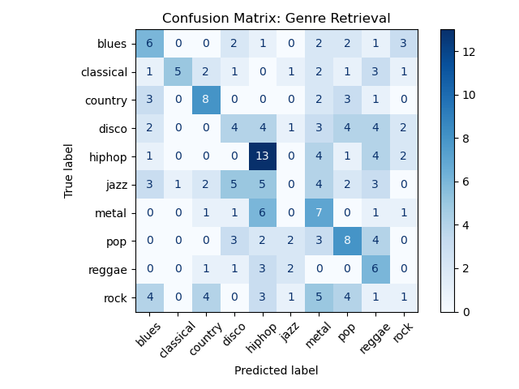
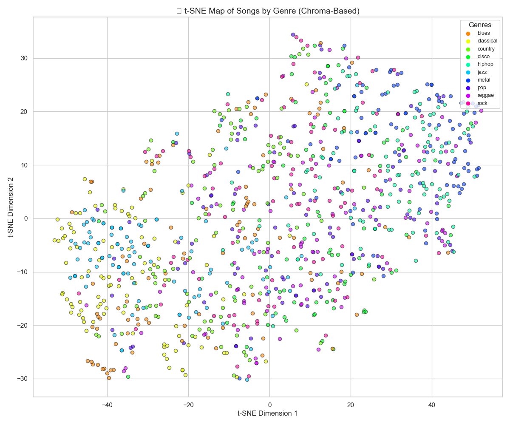
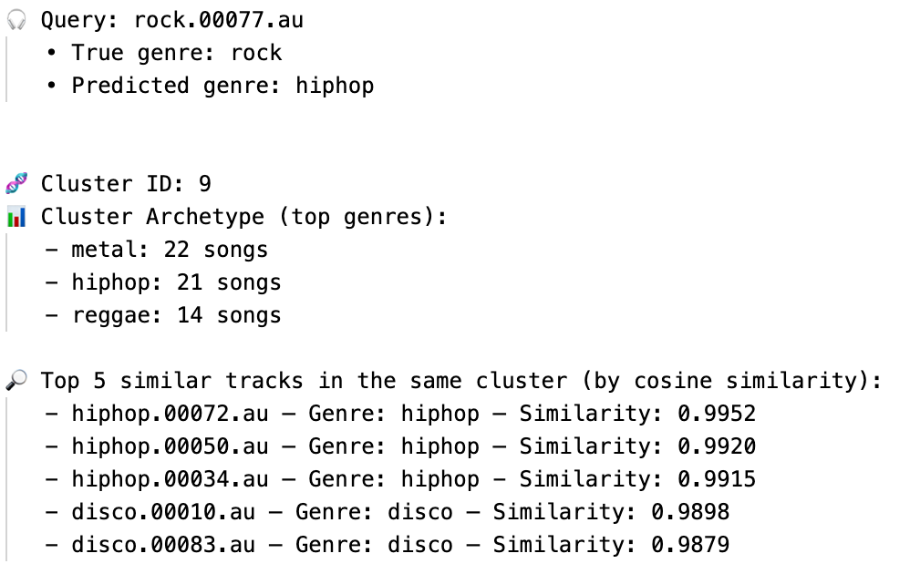

# Music Similarity & Genre Exploration Agent

This project is a content-based music exploration and recommendation agent.
It uses audio feature extraction, unsupervised clustering, and a graph-based
influence model to group songs and suggest similar tracks, going beyond simple
genre labels.

**Tech Stack:** Python, Librosa, Scikit-Learn, NetworkX, Matplotlib, Seaborn, yt-dlp, pydub, FFmpeg  
**Skills Demonstrated:** Machine Learning, Signal Processing (DSP), Graph Algorithms, Data Visualization, Systems Design, CLI Tool Development

## 1. Motivation

Traditional music recommenders rely heavily on metadata- especially genre, artist, and mood tags. But listeners don't experience music as labels; they experience timbre, rhythm, tempo, harmony, and energy. I was curious what would happen if we ignored metadata completely and tried to group and recommend songs based only on how they *sound*.

This project explores three questions:
- Do unsupervised clusters of audio features naturally align with human created genre labels?
- Where do they diverge, and what does that say about cross genre similarity?
- Can a retrieval agent recommend music by acoustic similarity rather than by genre category?

The result is a content-based music exploration tool that extracts audio features, clusters songs in feature space, builds a similarity graph, and recommends similar tracks via a CLI interface, including support for YouTube URLs.

In short, this project was an opportunity to combine my interests in machine learning, signal processing, and music, and to explore how algorithms can capture something as subjective as similarity.

## 2. High-Level Architecture

1. **Dataset ingestion** – songs organized into genre folders under `data/songs/`.
2. **Feature extraction** – librosa computes chroma, spectral centroid/bandwidth,
   spectral rolloff, spectral contrast, and tempo for each track.
3. **Fingerprinting** – features are aggregated into a fixed-length fingerprint
   vector per song.
4. **Clustering** – K-Means groups songs into latent clusters.
5. **Graph + PageRank** – build a similarity graph and run PageRank to find
   central, representative songs.
6. **Agent interface** – a command-line tool that takes either a local audio file
   or a YouTube URL and returns:
   - predicted cluster / genre
   - the cluster's genre distribution (its "archetype")
   - a set of recommended similar songs.

A rough diagram:

`audio files -> feature extraction -> fingerprints -> clustering & graph -> saved metadata -> CLI agent`

## 3. Key Technologies

- **Python**
- **librosa** – audio loading & feature extraction
- **scikit-learn**
  - `KMeans` for clustering
  - `TSNE` for 2D visualization
  - `cosine_similarity` for fingerprint matching
- **networkx** – building a song similarity graph and running PageRank
- **matplotlib / seaborn** – confusion matrix & t-SNE plots
- **yt-dlp + pydub (+ ffmpeg)** – download and convert audio from YouTube URLs
- **pickle** – store precomputed model metadata (`results/agent_metadata.pkl`)

## 4. Results

### Confusion Matrix: Genre Retrieval



- Some genres (e.g., hiphop, metal, country) map strongly to single clusters.
- Others (e.g., blues/rock, disco/pop, jazz/disco) blur together, revealing
  cross-genre similarity.

### t-SNE Visualization



- Each point is a song in a 2D projection of the audio feature space.
- Colors indicate the true genre label.
- Local neighborhoods capture similarity better than strict genre boundaries.

## Example CLI Query

Below is an example of the agent retrieving similar songs for a rock track:



## What I Learned
- Built a complete ML pipeline end-to-end (not just model training)
- Hands-on experience with digital signal processing and low-level audio features
- Why genre classification is fundamentally limited compared to similarity search
- Working with large Python dependency stacks and reproducibility tools (requirements.txt)
- Interpreting unsupervised learning using confusion matrices and t-SNE visualizations
- Applying graph theory (PageRank) to ranking and recommendation problems
- Designing a CLI-based “agent” interface for real human interaction

## 5. Running the Project

> **Note:** Because of dataset magnitude and licensing, audio files are not included.
> You can recreate the structure with your own 10-genre dataset under `data/songs/genre/`.

Install dependencies:

```bash
pip install -r requirements.txt
```

Train the offline agent:
```bash
Copy code
python main.py
```
This computes features, builds the fingerprint index and influence graph,
runs clustering, and saves metadata under results/.

Query with a local audio file:

```bash
python query_interface.py path/to/song.wav
```

Query with a YouTube URL:
```bash
python query_youtube.py "https://www.youtube.com/watch?v=...."
```

## 6. Limitations & Future Work

The system uses relatively simple summary statistics of audio features.

Genre labels do not perfectly align with cluster structure, which is expected:
musical similarity is continuous and can cross genre boundaries.

Future ideas:

- replace hand-crafted features with embeddings from a pretrained model
- use a more robust evaluation set
-  deploy a small web interface with an interactive t-SNE song explorer and cluster visualization, backed by a cached fingerprint index for real-time recommendations.

## 7. Repository Structure
```bash
.
├── audio_processing.py
├── fingerprint_index.py
├── clustering_analysis.py
├── influence_graph.py
├── query_interface.py
├── query_youtube.py
├── visualize_tsne.py
├── main.py
├── config.py
├── data/
│   └── songs/           #one folder per genre
└── results/
    ├── confusion_matrix.png
    └── tsne_map.png
```
